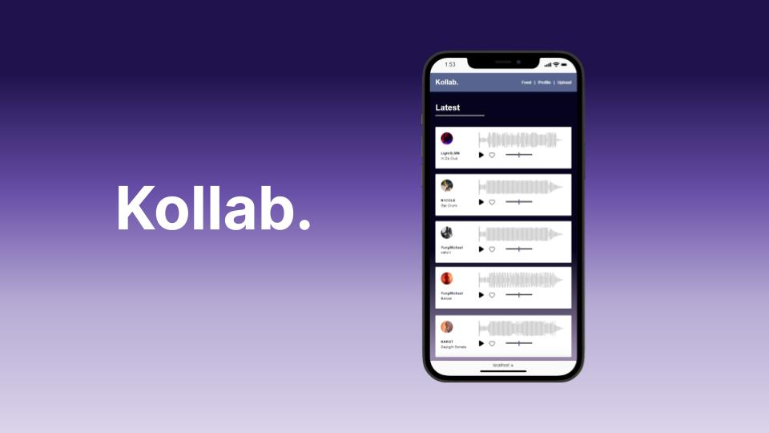

# kollab
***The only professional tool you'll need to grow as a creative!***

This is my capstone project that I have built from start to finish for BrainStations web development bootcamp. I was given the opportunity to demonstrate my knowledge by building a full-stack application over two weeks. I utilized React.js, SCSS, Node.js, Express.js, JWT, Knex, MySQL, and AWS S3 to build this project. 



# Installation

Follow these steps to run a local instance of Kollab:  
(You'll need node, npm, and MySQL already installed.)

1. Clone or download this repo.

#### Set up the backend

2.  Create a new database in MySQL called `kollab`.
3.  Install server dependencies:

    Run `npm install` from inside the server directory.

    ```bash
    $ cd server
    $ npm install
    ```

4.  Run migrations
    ```bash
    $ npm run migrate
    ```
5.  Run seeds
    ```bash
    $ npm run seed
    ```
6.  Create AWS S3 bucket, set to public access

7.  Create bucket policy and retrieve bucket keys

8.  Set environment variables:

    Rename `.env_template` to `.env` and change placeholder values with your own.

          ```shell

    PORT=<PORT NUMBER>
    SECRET_KEY=<JWT SECRET KEY>
    DB_HOST=<HOST ADDRESS>
    DB_USER=<MYSQL DATABASE USER>
    DB_PASSWORD=<MYSQL DATABASE PASSWORD>
    AWS_BUCKET_NAME=<AWS S3 BUCKET NAME>
    AWS_BUCKET_REGION=<AWS S3 BUCKE REGION>
    AWS_ACCESS_KEY=<AWS S3 ACCESS KEY>
    AWS_SECRET_ACCESS_KEY=<AWS S3 SECRET ACCESS KEY>

````
9. Start the server:
```bash
$ node index.js
````

#### Set up the frontend

8. Install client dependencies:

   Run `npm install` from inside the client directory.

   ```bash
   $ cd ../client
   $ npm install
   ```

9. Set environment variables:

Rename `.env_template` to `.env` and change the placeholder value to the port you set for the server.

```shell
REACT_APP_API_URL=http://localhost:<PORT SET IN /server/.env>
```

11. Start the React app:
    ```bash
    $ npm start
    ```
